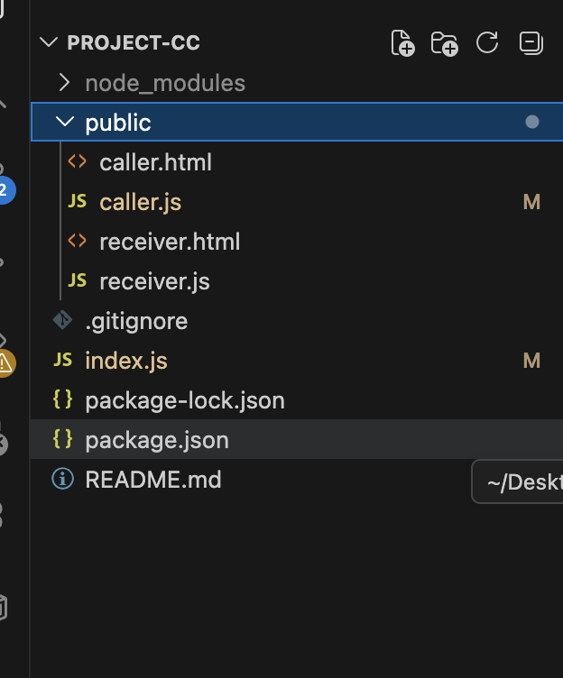
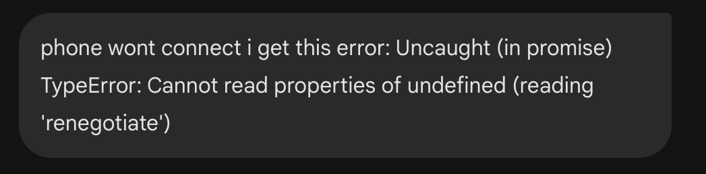
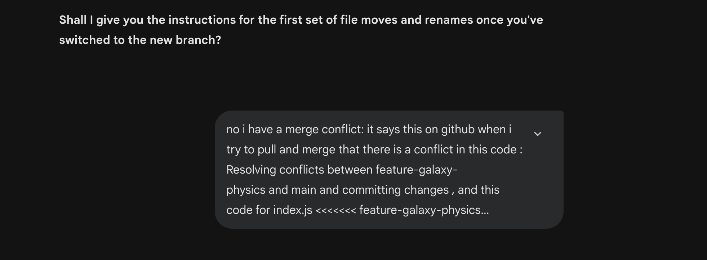
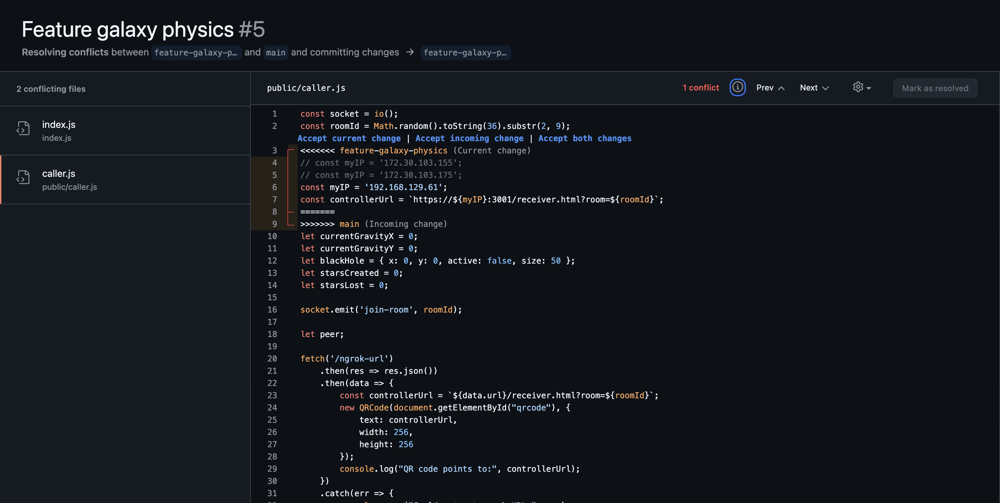
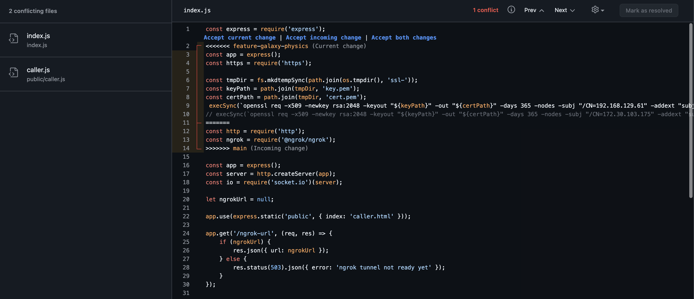

# space Conductor
a webRTC-based interactive experience where a smartphone controls a starfield on a laptop.

## development

### week 1: foundation
* **goal:** establish a connection between two devices.
* **progress:** * set up Node.js server with express and socket.io.
    * implemented QR code generation using local IP through my wifi.
    * paired phone and laptop via room ids.
    * consult feedback: so far so good, minimum set up is done properly

### how i used ai
Week 1: I used Gemini to help structure the project architecture when i missed details or left out a line, usually a typo would occur or something of the sort which i would overlook

### reflection(s)
The AI helped me understand the "signaling" concept which was confusing at first when i had to go through the walkthrough once again.

### week 2: webRTC & data channels
* **Goal:** from WebSockets to direct WebRTC data transfer.
* **progress:** * set up Node.js server with express and socket.io.
    * continued working on the signaling server and continued this on a branch for the feature webrtc 
    * for the webRTC there was an issue where the signaling offer is received but answer is not sending, so this was what took most time fixing because the server handler did not call and i had to switch io.to(roomID).emit() to socket.io... , this caused each peer to receive its own messages back which apparently shouldn't be the case
    * to test out the phone to laptop tracking i added some star visuals that appear when the user drags their finger over the screen

### how i used ai

Week 2: For the signaling problem after a lot of trial and error in finding the issue i was able to pinpoint what went wrong with Claude and further used it to mainly clean up/structure my code as most of it was crammed in one huge script tag.

### week 3: visuals
* **Goal:** The plan for week three is to workout the creative experience part, i want to test out creating a slider that would allow to change color for the stars & 
additional ways to let the user "build" the space starfield to their own liking

* **progress:** * encountered and bypassed mobile browser restrictions on gyroscopes by implementing a self-signed HTTPS server and an explicit "Permission Request" flow.

    * created a Canvas-based star class supporting physics propertie like mass &velocity
    * implemented a tools bar on the phone allowing for real-time color shifts & shape selection, and size choices to pick from with different velocity depending on its size
    * added a black hole to the space with a gravitational pull that scales based on proximity and star mass
    * added a scoring system (unfinished)

### how i used ai

Week 3: The AI was instrumental in debugging complex JavaScript scope issues (ReferenceErrors) and resolving Git merge conflicts during major file refactors, i had accidentally made a mistake in my merging when i wanted to branch out and i used copilot to guide me into safely making sure i don't mess up my files or make an irreversible mistake. 
    

### week 4: adapting
* **Goal:** receive consult and see what is lacking, and work this out first. Workout a level system and perhaps elevate the black hole interactivity? adding different stages or an increasing black hole..
* **progress:** * i had changed my intiial ssl certificate method to use ngrok after checking in with ai whether my methods were outdated or not and it suggested to adapt to ngrok, post consult it was mentioned to not do this so i went back in my commit history and set my intial set up again

    * undoing errors post consult (ngrok was not necessary), on consult the slider was a tap rather than actually sliding, so this was a small adaptation ux/ui wise that could be fixed 

### how i used ai

Week 4: Trying to go back from ngrok, i asked ai to check if i was approaching the step back to undo the commit correctly

### week 5: ui overhaul & physics refinement
* **Goal:** finalize the visual aesthetic, fix lingering bugs, and refine user onboarding.
* **progress:** 
    * debugged and fixed the WebRTC handshake issue where the sender wasn't properly listening to the receiver's response signal after fixing project structure a second time post consult
    * recovered and tweaked star physics: restored black hole gravity pulling mapped to mass, and optimized heavy star acceleration with square root mass calculations for better game feel.
    * resolved a touch-event overlap bug on mobile, allowing native `input` range sliders to work without being blocked by canvas drawing interactions.
    * changed the "sender" phone UI to a futuristic neon dashboard with glowing toggles instead of standard `<select>` dropdowns.
    * I implemented a localized finger trail glow on the phone to give immediate visual feedback because i noticed the confusion during consult when the teacher tried to draw something on the phone..
    * refined layout of the desktop receiver UI, anchoring stats cleanly, restructuring the QR code size, and adding an introduction modal that defers game loop start until a button is clicked.
    * safely staged and resolved divergent git branch merge conflicts post-refactor, ensuring our fresh codebase synced perfectly to the remote repository.

### how i used ai

Week 5 Before starting again, i had received consult feedback that my structure with the sender & receiver was actually the other way around, i had put the caller on the desktop instead! so this had to be fixed and i tried using Gemini to do so as my entire project structure needed some cleaning as well, but later i noticed it affected some of my functionalities as well and i had to go back to fix connection problems once again

I utilized the AI to figure out why the SimplePeer connection failed on the sender screen (missing the return signal listener), fine-tune the game loop physics, add custom touch gesture tracking without breaking HTML inputs and helping me navigate terminal commands to resolve a messy detached Git conflict.

### how i used ai

some other prompts used:

"let's work on differnt star types, like heavy ones that move slower"
"im currently on feature-galaxy-physics and i see that i suddenly have a controller html and index html and a receiver html, my files got spread across wrong branches i think how do i fix this safely"
"how do i change the peer on data in caller js here? I mistyped and can't find the issue"
"

